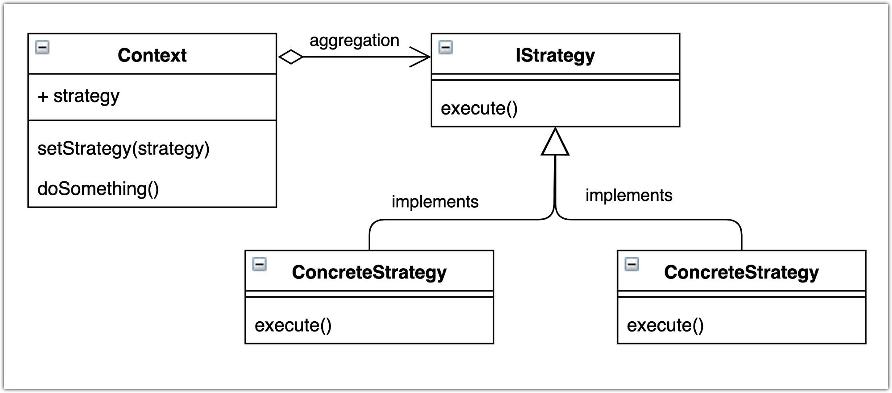

# Strategy pattern

This module demonstrates how to code a simple strategy pattern in Java and how it works.

## Use case
We're creating a simple message processor system that mya receive different types of messages. 
Depending on the type of message received we'll be performing different actions.

Three types of messages are supported:
* User messages
* Company messages
* Admin messages

The overall simulated flow is the following:
1. Any message is received
2. Message is sent to the message processor
    1. Message processor looks up in the strategy list for a matching one
    2. If a matching strategy is found, its process method is called.

## Class diagram
