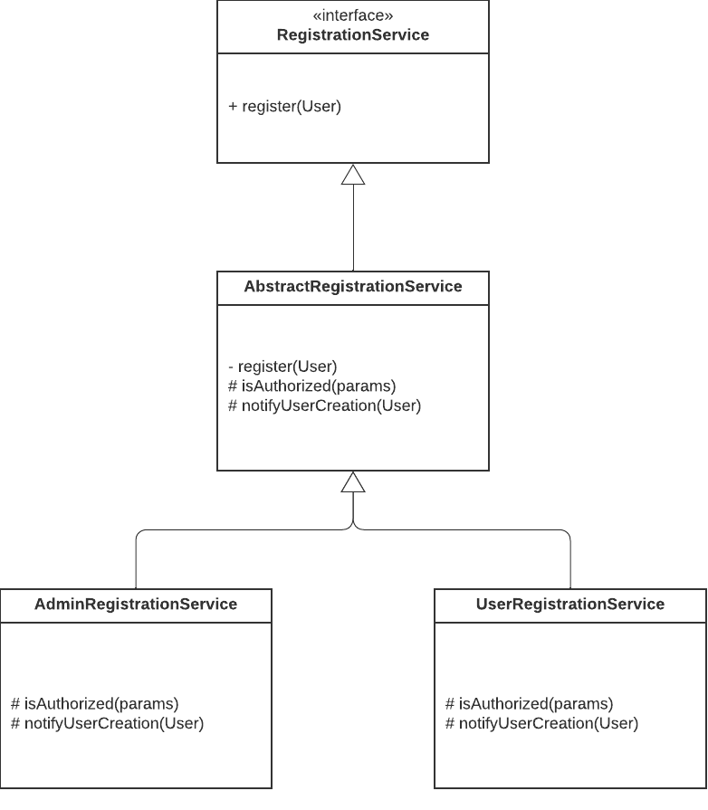

# Template pattern

This module demonstrates how to code a simple template pattern in Java and how it works.

## Use case
We're exposing some user registration functionality. 

Two types of users are supported which are represented in a single class User:
* Admin users
* Standard users

The common flow for any request is the following:
1. Validate user existence
2. Validate that the logged user has rights to create new users
   1. Any admin user can create users
   2. A standard user can only create users if they own the corresponding permissions
3. Persist the user
4. Notify user creation

## Class diagram

